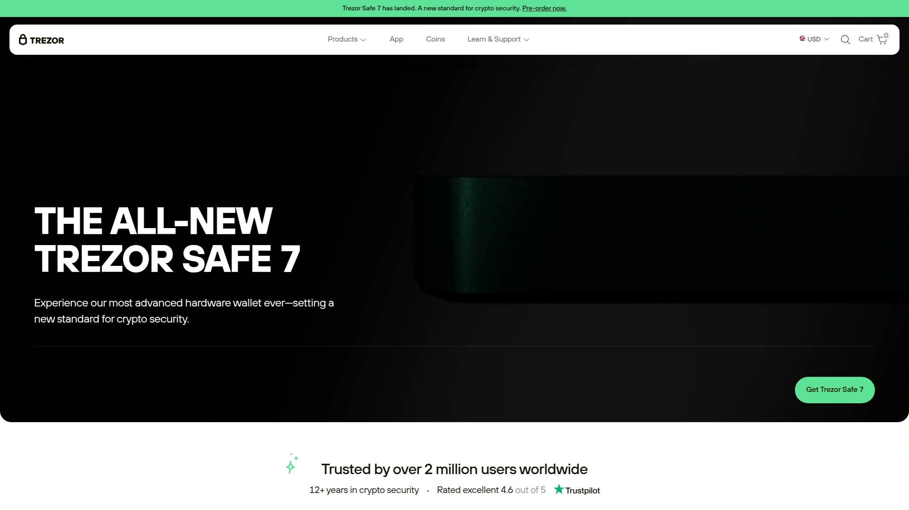

# 2025's 18 Best Multi-Chain Crypto Wallets (Latest Update)

Managing your digital assets shouldn't feel complicated—whether you're storing Bitcoin for the long haul, exploring DeFi opportunities, or just making your first crypto purchase. The right wallet becomes your gateway to the entire blockchain world, balancing security with everyday usability. From battle-tested hardware solutions to innovative mobile-first designs, these platforms let you control your keys, connect to thousands of dApps, and move between networks without friction.

---

## **[Guarda](https://guarda.com)**

Complete multi-currency solution for Web3 asset management across 70+ blockchains.

**Core Capabilities**

Guarda delivers comprehensive crypto management through its multi-platform approach. Available as web, desktop, mobile, and browser extension versions, the wallet supports over 400,000 tokens spanning major networks like Ethereum, Bitcoin, Solana, and Binance Smart Chain. The non-custodial architecture means your private keys stay exclusively on your device—Guarda never stores or accesses your funds.

**Built-In Services**

The platform integrates essential crypto operations directly into the interface. Purchase over 50 cryptocurrencies using credit cards or bank transfers, with fiat gateway access across 150+ countries. Exchange between assets instantly through aggregated liquidity providers who scan multiple DEXs for optimal rates. Stake trending assets with annual yields reaching nearly 40% on supported networks.

**Experience Design**

Setup takes minutes with straightforward wallet creation—no KYC required for basic functions. The backup system uses standard 12-word recovery phrases, though users can opt for additional password encryption. Transaction previews display clear details before signing, and the interface switches seamlessly between light and dark modes. Hardware wallet integration provides extra security layers for users wanting cold storage options combined with hot wallet convenience.

Guarda suits anyone needing full-spectrum crypto management without platform lock-in, from newcomers buying their first coins to experienced traders managing diverse portfolios across multiple chains.

---

## **[MetaMask](https://metamask.io)**

Industry-standard gateway for Ethereum and EVM-compatible chains, trusted by millions.

MetaMask pioneered browser-based crypto wallets and remains the go-to choice for Ethereum ecosystem interaction. The extension integrates with Chrome, Firefox, Brave, and Edge, while mobile apps bring the same functionality to iOS and Android. Beyond Ethereum mainnet, MetaMask supports Layer 2 networks like Arbitrum, Optimism, and Polygon, plus other EVM chains through custom RPC connections. The built-in swap feature aggregates quotes from major DEXs, letting you trade tokens without leaving your wallet.

Portfolio tracking displays your holdings with real-time price updates and 24-hour change percentages. Security features include phishing detection, domain allowlists, and transaction simulation that shows exactly what each approval does before you sign. The Snaps system extends functionality through community-built plugins—add Bitcoin support, integrate with messaging apps, or connect to alternative consensus mechanisms. Token allowances get granular control, so you can revoke suspicious permissions or set spending limits.

For NFT collectors, MetaMask displays your entire collection with image previews and metadata. Connect to any dApp with one click, from DeFi protocols like Aave and Uniswap to gaming platforms and NFT marketplaces. Gas fee customization lets you prioritize speed or savings, with clear estimates in both ETH and USD. The wallet also supports hardware devices like Ledger and Trezor for cold storage security combined with hot wallet flexibility.

---

## **[Trust Wallet](https://trustwallet.com)**

Mobile-first powerhouse with 200+ million users, covering 100+ blockchains seamlessly.

Trust Wallet earned its massive user base by making multi-chain crypto accessible on smartphones. The non-custodial design stores private keys locally on your device, encrypted with AES-256 and protected by biometric authentication. Support spans from Bitcoin and Ethereum to Solana, Cosmos, and emerging Layer 1 networks—over 10 million assets in total. The integrated dApp browser connects you to thousands of Web3 applications, filtered by blockchain for easy navigation.

Staking functionality covers 23 cryptocurrencies with flexible terms and competitive yields. Purchase crypto through multiple fiat on-ramps, choosing between providers based on fees and payment methods. The NFT section organizes your collectibles across chains, with spam filters blocking suspicious tokens. Security Scanner examines smart contracts before you interact, warning about potential risks. WalletConnect enables desktop dApp connections by scanning QR codes with your phone. Push notifications keep you updated on incoming transactions, price alerts, and important security announcements.

---

## **[Ledger Nano X](https://www.ledger.com)**

Premium hardware security meeting mobile convenience through Bluetooth connectivity.

The Nano X represents Ledger's top-tier hardware wallet, supporting 5,500+ coins and tokens while maintaining bank-level security. The device stores private keys in a Secure Element chip certified to CC EAL5+ standards, isolating them completely from internet-connected devices. Bluetooth pairing lets you manage assets from your smartphone via the Ledger Live app, checking balances and signing transactions on the go. The larger battery supports extended mobile sessions without tethering to power.

Ledger Live serves as your crypto hub—buy, sell, swap, and stake directly through vetted service providers. The portfolio overview tracks performance across all your holdings with detailed charts and transaction history. Firmware updates arrive over-the-air, adding support for new blockchains and security patches. The built-in screen displays transaction details for manual verification—amounts, addresses, and network fees appear before you approve with physical button presses. NFT management lets you view and transfer collectibles, with support for major standards like ERC-721 and ERC-1155.

For advanced users, custom apps extend functionality beyond Ledger's official suite. Install tools for specific blockchains, DeFi protocols, or development work. The Nano X also supports BIP39 passphrases for plausible deniability and inheritance planning. Backup your 24-word recovery phrase on the included steel sheet, creating an indestructible physical copy resistant to fire and water damage.

---

## **[Coinbase Wallet](https://www.coinbase.com/wallet)**

Self-custody solution backed by trusted exchange brand, designed for mainstream adoption.

Coinbase Wallet separates from the main Coinbase platform, giving you full control over private keys while maintaining the user-friendly interface that made the exchange popular. Available as mobile app and browser extension, it supports Ethereum, Polygon, Avalanche, BNB Chain, and dozens of other networks through seamless switching. The dApp browser provides curated access to verified applications, with built-in protection against malicious contracts.

Recovery options include cloud backups encrypted with your own password, eliminating the need to manually secure seed phrases. For traditionalists, standard 12-word phrases remain available. Link your Coinbase exchange account for instant transfers between self-custody and custodial storage, useful when moving between cold storage and active trading. The Quests feature gamifies crypto education—complete learning modules and earn small amounts of various tokens.

Transaction previews break down complex interactions into plain language, showing what you're actually approving before signing. Gas fees display in both native tokens and fiat equivalents, with options to adjust speed and cost. NFT galleries organize your collection by network and collection, with floor price data from OpenSea. WalletConnect integration enables connections to desktop dApps, while biometric authentication secures mobile access. Push notifications alert you to incoming funds, transaction confirmations, and security updates.

---

## **[Exodus](https://www.exodus.com)**

Beautiful desktop-and-mobile wallet with built-in exchange and beginner-friendly design.

Exodus brings Mac-level polish to crypto storage, featuring an interface that prioritizes aesthetics without sacrificing functionality. Desktop versions for Windows, Mac, and Linux sync with mobile apps via a secure connection, letting you manage the same wallet across devices. Support covers 250+ cryptocurrencies and thousands of tokens, with one-click asset additions through an extensive token library.

The built-in exchange aggregates liquidity from major providers, comparing rates to find you the best prices. Transactions happen entirely on your device—no account creation, no email verification, no personal data collection. Staking integrations let you earn rewards on assets like Cardano, Solana, Cosmos, and Tezos with single-click delegation. Portfolio charts display your holdings over time with customizable views showing daily, weekly, or all-time performance.

Advanced features hide behind a clean primary interface. Adjust network fees manually when blockchain congestion demands it, or let the wallet optimize automatically. Hardware wallet support brings Trezor devices into the Exodus ecosystem, combining cold storage security with the polished software experience. Private key export enables migration to other wallets if needed, though the 12-word recovery phrase remains the standard backup method. Live support responds 24/7 through in-app chat, helping troubleshoot issues without requiring technical expertise.

---

## **[Phantom](https://phantom.com)**

Solana specialist expanding to multi-chain, beloved for speed and user experience.

Phantom launched as Solana's premier wallet and quickly became the network's most popular interface. The browser extension and mobile apps now support Ethereum, Polygon, Bitcoin, Base, and Sui alongside Solana, turning Phantom into a genuine multi-chain solution. The interface emphasizes speed—transactions confirm in seconds on Solana, with clear status indicators and instant balance updates. Built-in swaps use aggregators to find optimal prices across DEXs, supporting both same-chain and cross-chain exchanges.

Token Pages surface trending assets with detailed metrics like market cap, volume, and price charts, shareable directly to social media. NFT functionality shines with compressed NFT support unique to Solana, dramatically reducing storage costs for large collections. The dApp browser organizes applications by category—DeFi, NFTs, gaming, social—with direct connections requiring no external tools. Staking options include both native delegation and liquid staking, the latter generating yield-bearing tokens usable across DeFi protocols.

Security features protect against common threats. Transaction simulations preview exactly what each approval does, blocking suspicious requests. The wallet maintains a blocklist of known scam domains, updated regularly by the security team. Ledger integration brings hardware wallet support to mobile users, a rare combination. Face ID and Touch ID authentication secure access on smartphones, while desktop users can set custom passwords. The Solana-Only mode hides other chains when you want focused interaction with the Solana ecosystem.

---

## **[Zengo](https://www.zengo.com)**

Seedless security through cutting-edge MPC technology, eliminating recovery phrase vulnerability.

Zengo revolutionizes wallet security by removing the weakest link—recovery phrases. Multi-Party Computation splits your private key into two mathematical shares, one stored on your device and one on Zengo's servers, with neither share usable alone. Recovery uses three-factor authentication: your email, facial recognition scan, and an encrypted recovery file. The approach eliminates phishing risks targeting seed phrases while maintaining true self-custody—Zengo cannot access your funds.

The wallet supports 380+ coins across 10 networks including Ethereum, Bitcoin, Binance Smart Chain, and Polygon. Buy crypto directly through integrated on-ramps accepting credit cards, bank transfers, and payment apps like PayPal. Swap between 60 assets using aggregated liquidity from partners like Changelly and THORChain. The interface guides newcomers through their first transactions with clear explanations and confirmation steps, never assuming technical knowledge.

Web3 Firewall adds proactive protection, analyzing dApp connections before you interact. Connect to decentralized applications through WalletConnect, with risk assessments warning about suspicious contracts or unusual permission requests. Legacy Transfer planning lets you designate beneficiaries who can access your crypto after extended periods of inactivity, solving the inheritance problem that plagues traditional seed phrases. 24/7 support responds through in-app chat, staffed by humans who understand the platform deeply. The wallet has maintained a zero-hack record since launch in 2018, backed by ISO 27001 and 27701 security certifications.

---

## **[Trezor Model T](https://trezor.io)**

Open-source hardware standard with touchscreen interface and decade-long security reputation.

Trezor pioneered hardware wallets and the Model T continues that legacy with refined features. The color touchscreen eliminates button-based navigation, making wallet interaction more intuitive while maintaining Trezor's commitment to open-source transparency. Every line of firmware code undergoes community scrutiny, with regular security audits published publicly. Support spans 1,450+ coins and tokens, covering Bitcoin, Ethereum, and most major blockchain networks.

Shamir Backup upgrades traditional seed phrases by splitting recovery into multiple shares—choose how many shares to create and how many are needed for recovery. This approach protects against single points of failure while maintaining compatibility with BIP39 standards. The Trezor Suite desktop application manages your holdings with advanced features like coin control for Bitcoin, letting you select specific UTXOs for transactions. Tor integration anonymizes your IP address when syncing balances or broadcasting transactions.

Advanced features serve power users without overwhelming beginners. Set up passphrase-protected hidden wallets for plausible deniability, or use the device as a U2F authentication token for two-factor security across web services. Coinjoin support enables Bitcoin privacy mixing directly through Suite, breaking transaction linkability. The Model T also functions as a GPG encryption device, letting you sign emails and encrypt files with the same hardware protecting your crypto. Firmware updates arrive through the Trezor Suite, each signed cryptographically to prevent malicious modifications.

---

## **[Tangem Wallet](https://tangem.com)**

Credit-card hardware wallet removing seed phrases entirely, powered by tap-to-sign NFC.

Tangem reimagines cold storage as a wallet-sized card containing an EAL6+ certified secure chip. Private keys generate inside the card and never leave it—no seed phrases to write down, no screens displaying sensitive information. Setup takes three minutes: download the app, tap the first card to your NFC-enabled phone, create a backup by tapping additional cards. Each card in your set (typically three) holds identical keys, providing redundancy without exposing the key during backup.

Support covers 6,000+ cryptocurrencies across 30+ blockchains including Bitcoin, Ethereum, Solana, Cardano, and Polkadot. Buy, sell, and swap directly through the Tangem app using integrated services, with the card tapping once to authorize each transaction. The physical design withstands water, extreme temperatures, and rough handling—no batteries to charge, no screens to crack. Perfect for travelers who want cold storage security without bulk.

The seedless approach solves seed phrase vulnerabilities while maintaining true self-custody. Lose one card? The backups work immediately without ceremony. Lose all cards? Recovery becomes impossible, emphasizing the importance of storing backup cards in separate locations. The app provides DeFi access through WalletConnect, letting you interact with dApps while keys stay offline in the card. Tangem's open-source app and firmware undergo regular security audits, with results published for public review.

---

## **[Atomic Wallet](https://atomicwallet.io)**

Decentralized multi-currency platform with atomic swap technology and built-in exchange.

Atomic Wallet pioneered cross-chain atomic swaps, enabling peer-to-peer cryptocurrency exchanges without intermediaries or custodians. The non-custodial desktop and mobile apps support 300+ blockchains and over 1,000 cryptocurrencies, from household names to emerging altcoins. Your private keys encrypt locally on your device, never touching Atomic's servers or third-party services.

The built-in exchange offers two swap methods: atomic swaps for direct peer-to-peer trading, and instant exchanges through partner services when atomic capability isn't available. Cashback rewards return a percentage of exchange fees in the wallet's native AWC token, stackable for additional benefits. Staking covers popular Proof-of-Stake assets with competitive yields displayed directly in the wallet interface. Purchase crypto with credit cards through integrated on-ramps, choosing between providers based on fees and supported regions.

Portfolio tracking aggregates balances across all supported assets with charts showing historical performance. Token management lets you hide or customize display of specific assets, keeping your interface focused on active holdings. Backup occurs through a standard 12-word mnemonic phrase, with options for additional password encryption. The wallet also generates individual private keys for each cryptocurrency, exportable when needed for specialized blockchain interactions. Atomic's membership program rewards active users with lower exchange fees and priority support, though the free version serves most users perfectly.

---

## **[Bitget Wallet](https://web3.bitget.com)**

Comprehensive Web3 hub connecting 130+ chains with DeFi, NFTs, and trading tools.

Bitget Wallet evolved beyond simple storage to become a complete Web3 operating system. Multi-chain support spans 130+ blockchains, letting you manage Bitcoin, Ethereum, Solana, TON, and countless others through a unified interface. The non-custodial architecture combines with a $300 million protection fund that insures against platform-level security failures—a rare safety net in the self-custody space.

DeFi integration goes deep with native DEX aggregation across major networks, scanning liquidity pools to find optimal swap rates. Yield farming opportunities appear directly in the wallet with APY comparisons across protocols. The NFT marketplace lets you browse, buy, and sell collectibles without leaving the app, with support for multi-chain NFTs uncommon in competing wallets. Launchpad access gives early participation in token sales and IDOs, typically reserved for dedicated platforms.

The wallet offers multiple login options catering to different user types. Traditional Web3 users choose standard seed phrase setup, while Web2 newcomers can access through email, Google, Apple ID, or Telegram—lowering barriers for mainstream adoption. MPC technology secures high-value accounts requiring institutional-grade protection. Social recovery features let trusted contacts help restore access if needed, balancing security with usability. Built-in dApp browser organizes Web3 applications by category and blockchain, with quick-connect functionality requiring no external tools.

---

## **[Rainbow Wallet](https://rainbow.me)**

Ethereum-focused wallet where design meets functionality, now with points program.

Rainbow brings iOS-quality design to Ethereum wallet interfaces. The mobile app emphasizes visual polish—smooth animations, thoughtful color schemes, clear typography—making crypto management feel natural for Apple ecosystem users. Support covers Ethereum and major Layer 2 networks like Optimism, Base, Arbitrum, and zkSync, with automatic network detection simplifying multi-chain interactions.

The Rainbow Points program rewards on-chain activity with accumulating points based on swaps, bridges, and wallet connections. Referral bonuses grant 10% of points earned by friends you invite, with a $10 minimum swap requirement to activate earning. Points claim on supported Layer 2 networks with gas fees covered by Rainbow, removing friction from reward collection. The program builds toward future utility beyond simple tracking.

ENS integration enables sending crypto to human-readable names instead of hexadecimal addresses, dramatically reducing transaction anxiety. Hardware wallet support brings Ledger compatibility to mobile, rare in mobile-first designs. Transaction previews show USD value estimates alongside token amounts, with price impact warnings for large swaps. The built-in bridging function moves assets between networks with one tap, scanning multiple bridge providers for optimal rates and speed. NFT display prioritizes visual quality with full-resolution images and detailed metadata views.

---

## **[SafePal](https://www.safepal.com)**

Dual wallet ecosystem combining air-gapped hardware with feature-rich software.

SafePal offers both hardware and software wallets that work together or independently. The S1 hardware wallet operates completely air-gapped—no USB, no Bluetooth, no wireless connections—communicating through QR codes scanned by your phone. This approach eliminates remote attack vectors while maintaining user-friendly operation. The device supports 21 blockchains natively and over 15,000 tokens through smart contract interaction.

The SafePal app functions as a standalone software wallet or companion to hardware devices. Multi-sig support enables shared custody arrangements for business or family crypto holdings. NFT management spans major standards across supported chains, with marketplace integration for trading collectibles. The swap function aggregates quotes from decentralized exchanges, minimizing slippage and transaction costs.

Security layers stack impressively: hardware wallets combine secure element chips with user-controlled backup phrases, software wallets offer biometric authentication plus customizable security passwords, and the Cypher metallic seed board provides fireproof, waterproof backup storage. Educational resources guide users through security best practices, hardware setup procedures, and recovery scenarios. The wallet also supports BNB Chain's special features, being a Binance Labs-backed project with tight ecosystem integration.

---

## **[Crypto.com DeFi Wallet](https://crypto.com/defi-wallet)**

Non-custodial companion to the Crypto.com exchange, built for DeFi exploration.

The Crypto.com DeFi Wallet gives users self-custody control separate from the main exchange platform. Available on iOS, Android, and desktop, it supports 1,000+ tokens across 20+ blockchains including Ethereum, Cronos, Cosmos, and Polkadot. The architecture stores private keys on-device with hardware-level encryption, never touching Crypto.com's servers despite the brand connection.

Integration with the Crypto.com exchange enables instant transfers between self-custody and custodial accounts, useful for moving between active trading and secure storage. Buy crypto directly through the wallet using credit cards or bank transfers, with fiat on-ramps supporting 100+ countries. Earn yields by depositing assets into DeFi protocols directly from the wallet interface—no manual dApp navigation required.

The Cronos blockchain receives special attention, being Crypto.com's native network. Access Cronos-based DeFi protocols, NFT marketplaces, and gaming platforms with optimized integration. Cross-chain bridges enable asset movement between supported networks without leaving the wallet. Track portfolio performance with detailed charts showing balance changes, transaction history, and realized gains. Security features include biometric authentication, customizable transaction approval settings, and integration with hardware wallets like Ledger for cold storage options.

---

## **[Coinomi Wallet](https://www.coinomi.com)**

Veteran multi-coin wallet emphasizing privacy and comprehensive altcoin support.

Coinomi has supported cryptocurrency diversity since 2014, currently managing hundreds of coins and thousands of tokens across major blockchain networks. The wallet prioritizes privacy—no account creation, no identity verification, no personal data storage. Each supported coin uses separate wallet infrastructure, isolating assets for enhanced security and simpler blockchain-specific features.

Built-in exchange integrations provide swap functionality through partners like Changelly and ShapeShift, comparing rates to find competitive prices. The wallet operates across Android, iOS, Windows, macOS, and Linux with consistent experiences despite platform differences. Hierarchical Deterministic (HD) wallet structure generates new addresses for each transaction, improving privacy by reducing address reuse.

Advanced coin support extends to obscure altcoins rarely found in mainstream wallets. Bitcoin support includes SegWit addressing for lower fees, while Ethereum integration handles all ERC-20 tokens through contract interaction. The wallet also supports Bitcoin Cash, Litecoin, Dash, and dozens of other chains with dedicated infrastructures. Custom token addition works through contract addresses, useful for newly launched projects. Native language support spans 25+ languages with full interface localization, not just simple translations. Security combines strong passwords, optional encryption, and standard 12/18/24-word recovery phrases depending on user preference.

---

## **[OKX Wallet](https://www.okx.com/web3)**

Exchange-branded Web3 gateway connecting 90+ chains with trading platform integration.

OKX Wallet bridges centralized and decentralized crypto, connecting seamlessly to the OKX exchange while maintaining true self-custody. Support spans 90+ blockchains from Bitcoin to emerging Layer 1 networks, managing hundreds of thousands of tokens through smart contract interaction. The browser extension and mobile apps provide consistent experiences across desktop and mobile platforms.

Trading tools integrate directly—view real-time prices, set alerts, and execute swaps without leaving the wallet interface. DEX aggregation scans liquidity across multiple decentralized exchanges, routing trades through optimal paths for best execution. NFT marketplace access covers OpenSea, Blur, and dozens of other platforms, with integrated bidding and purchasing. The wallet also supports GameFi interactions, connecting to blockchain games with asset management and transaction signing.

Gas optimization automatically suggests fee adjustments based on network conditions, balancing confirmation speed with cost savings. Multi-chain portfolio tracking shows aggregate holdings with performance charts and profit/loss calculations. Security scanner examines smart contracts before interaction, warning about potential risks or malicious code. The wallet supports hardware devices through WebUSB connections, bringing cold storage security to hot wallet convenience. Advanced features include custom RPC endpoints for direct node connections and batch transaction capabilities for complex DeFi interactions.

---

## **[Argent Wallet](https://www.argent.xyz)**

Ethereum Layer 2 specialist with social recovery and gas-free transactions.

Argent focuses exclusively on Ethereum's Layer 2 networks, optimizing for zkSync, Arbitrum, and Optimism. The wallet removes traditional recovery phrases, instead using social recovery through trusted contacts or the Argent Guardian service. Lose your phone? Approved contacts or Argent's system helps restore access without seed phrases. The approach prioritizes usability while maintaining self-custody principles.

Gas-free transactions come through meta-transactions and account abstraction, where Argent subsidizes network fees for common operations. Upgrade wallet functionality without migrating assets, as smart contract accounts enable programmable features impossible with traditional key-based wallets. DeFi integrations provide one-tap access to protocols like Aave, Compound, and Curve, with yield strategies presented in plain language.

Security features include transaction limits, wallet locking, and automatic risk assessment. The wallet displays security scores for DeFi protocols, helping users evaluate risks before depositing funds. NFT organization sorts collectibles by collection and network with filtering options. Argent's native token (ARG) unlocks enhanced features including reduced recovery waiting periods and higher transaction limits. The wallet also supports WalletConnect for desktop dApp connections, though mobile-first design shows through the interface polish.

---

## **[BlueWallet](https://bluewallet.io)**

Bitcoin purist's choice with Lightning Network and advanced UTXO management.

BlueWallet focuses intensely on Bitcoin, implementing advanced features specific to the network. Lightning Network support enables instant, low-fee Bitcoin payments through payment channels, with simplified channel management hiding technical complexity. SegWit addressing comes standard for lower transaction fees, while native SegWit (bech32) support maximizes savings for users accepting newer address formats.

UTXO management gives granular control over Bitcoin's underlying transaction structure. Select specific coins for spending, useful for maintaining privacy or accessing particular transaction history. Coin control also enables advanced strategies like consolidating small amounts during low-fee periods. The wallet supports multiple wallet types within the app: standard HD wallets for everyday use, watch-only wallets for tracking addresses without spending capability, and Lightning wallets specifically for instant payments.

Batch transactions combine multiple payments into single blockchain transactions, dramatically reducing fees when sending to many addresses. Replace-By-Fee (RBF) support lets you bump transaction fees after broadcasting, useful when network congestion increases unexpectedly. Hardware wallet integration brings Coldcard and other Bitcoin-focused devices into the BlueWallet ecosystem. Electrum server connection enables sovereign operation using your own Bitcoin node, removing reliance on third-party infrastructure. Despite Bitcoin specialization, the interface remains approachable for newcomers while exposing advanced tools for power users.

---

## **FAQ**

**How do I choose between hot and cold wallet storage?**

Consider transaction frequency and security needs. Hot wallets excel for active trading, DeFi participation, and regular transactions—keeping assets accessible on internet-connected devices. Cold wallets prioritize maximum security by isolating private keys offline, ideal for long-term holdings or large amounts you won't touch frequently. Many users employ both: cold storage for savings, hot wallets for spending.

**What makes multi-chain support important in 2025?**

Cryptocurrency ecosystems fragment across specialized blockchains—Ethereum for DeFi, Solana for speed, Bitcoin for value storage. Multi-chain wallets eliminate the need for separate interfaces, letting you manage diverse holdings through one application. This matters increasingly as assets bridge between networks and protocols deploy across chains. Single-chain wallets force app-switching overhead while multi-chain solutions streamline portfolio management.

**Can I recover my wallet if I lose access to my device?**

Recovery depends on backup methods. Traditional wallets use 12-24 word seed phrases that restore full access on any compatible wallet application—lose the device, keep the phrase, regain your crypto. Seedless wallets like Zengo use alternative recovery through biometric verification and encrypted files. Hardware wallets with backup cards, like Tangem, restore from duplicate cards rather than seed phrases. Always understand your specific wallet's recovery system before storing significant amounts.

---

## **Conclusion**

Finding the right crypto wallet balances security requirements, usage patterns, and supported assets. [Guarda](https://guarda.com) stands out for users needing comprehensive multi-chain access with integrated services—handling everything from basic storage to staking and exchanges across 70+ blockchains without compromising self-custody. Whether you're securing Bitcoin for decades, actively trading across DeFi protocols, or just starting your crypto journey, the right wallet makes blockchain interaction seamless while keeping your assets protected.
